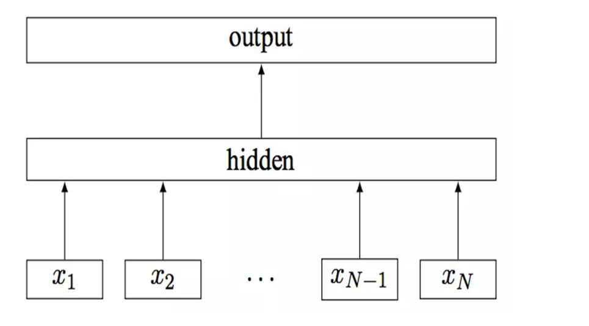
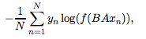
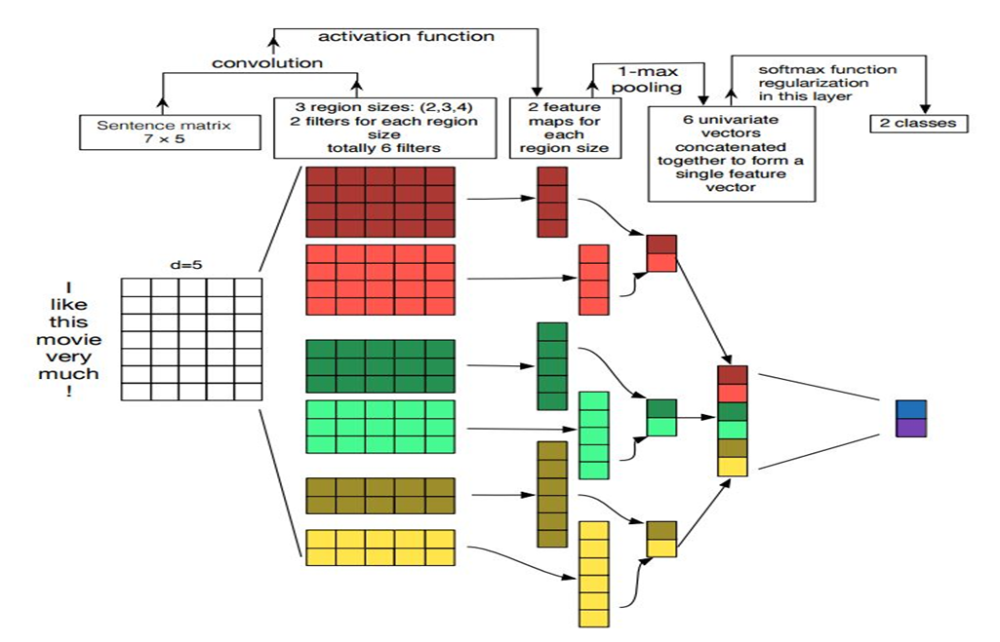
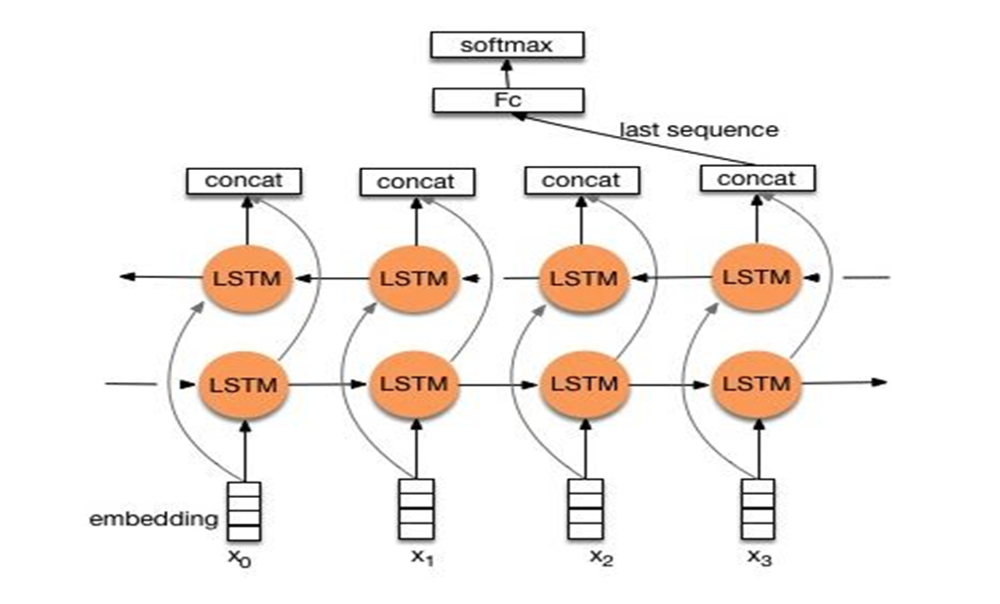
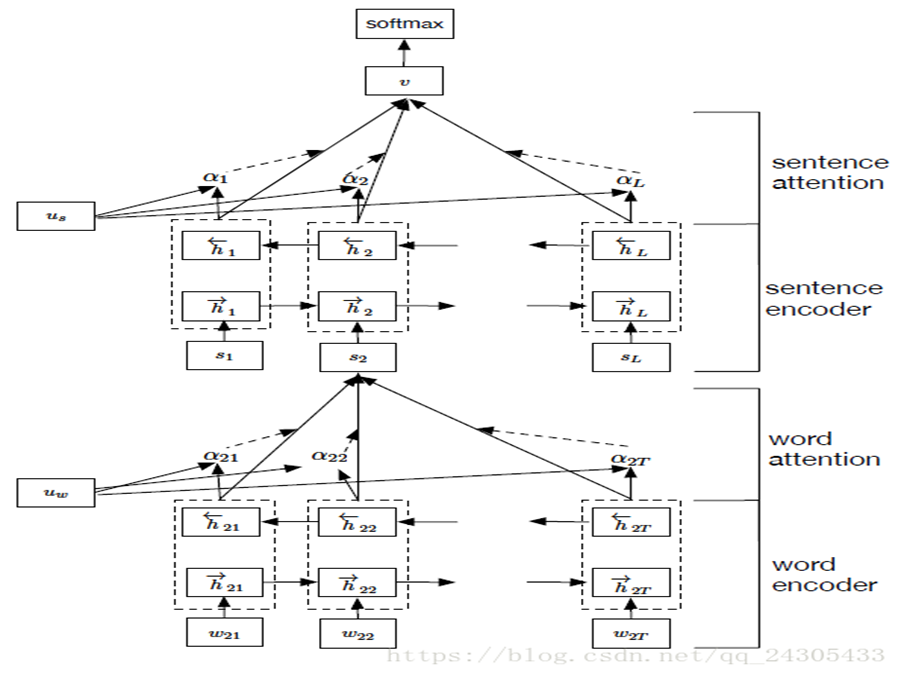
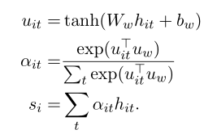

## 文本分类深度学习模型解析

### Fasttext

**Paper:** [Bag of Tricks for Efficient Text Classification](https://arxiv.org/pdf/1607.01759v2.pdf)

**模型架构解析：**该模型架构和word2vec中的cbow非常相似，只不过输出得是文档的类别标签。在输入方面fasttext使用N-gram作为附加特征来留存一些相近词序的部分信息。比如使用bigram，“今天天气很好”，输入的是“今天”，“天天”，“天气”，“气很”，“很好”，上图中$x_i$表示第$i​$个文本所有N-gram features的归一化特征袋（即所有特征词袋表示的平均值）。

fasttext使用 softmax 函数 f 来计算已知分类的概率分布。对于 N 个文档而言，这就会导致在分类上负对数似然的最小化，这也是模型在整个数据上的loss，公式如下图：

    

第一个权重矩阵$A$ 是基于单词的查找表，这样可以把单词平均转换到文本形式，这样就可以输入线性分类器，$B $是softmax层的权重矩阵。

**PS:** fasttext模型另一个重要的作用是可以学习词向量，其效果不亚于word2vec和glove。

### TextCNN

**Paper:** [Convolutional Neural Networks for Sentence Classification](https://arxiv.org/pdf/1408.5882.pdf)

**模型架构解析：**TextCNN用卷积来提取文本特征。由于CNN的输入维度大小是固定的，故首先需要将输入的句子填充或裁减为一个长度。每个词有其对于的词向量，这个可以使用预训练的词向量，也可以随机初始化交给神经网络训练。**以下考虑维度时不计batch的大小**，输入的数据就是一个二维张量，每一行代表该行对应词的词向量，列数等于指定的填充或裁减句子之后的长度。输入层之后使用的一维卷积，一维卷积可以把词向量的维度当做图像中的channel。卷积层可以采取不同尺寸的卷积核，从而可以获得不同的视野。由于是使用一维卷积相当于这是在做N-gram，只是在用卷积来提取特征，一维卷积层之后得到的也是二维张量，其中第二个维度等于使用卷积核的个数，上图中卷积之后的列向量表示的是每个卷积核作用的结果。然后再是经过一个池化层。该池化层取得是通过每个卷积核后得到的结果中所有元素的最大值，即max-pool，之后再把所有这样的最大值拼接起来得到一维张量（不计batch的size），维度就等于之前做cnn时使用卷积核的个数。这个操作相当于是把全局的序列信息保存下来，比如情感分析时：“我觉得这个地方景色还不错，但是人也实在太多了”，虽然前半句情感是积极的，但整个句子表达的是偏负面的情感。最后经过一个全连接层得到分类结果。

**PS：**文本本来是一维数据，虽然文本经过词向量表达后是二维数据，但是在embedding-level上的二维卷积没有意义，因此textcnn使用的是一维卷积。一维卷积也可以看成二维卷积的特殊情形。在使用tensorflow实现时可以用tf.nn.conv1d，同时也能用tf.nn.conv2d即二维卷积也能得到一样的结果，此时的二维卷积可以看做是输入通道为1，卷积层卷积核宽度为词向量的维度，池化层卷积核的宽度为序列长度减去池化层卷积核长度加上1，详见下面推荐的代码1（这里说的长度指行数，宽度指列数）。

实现textcnn的代码有很多，下面是亲测的两个能运行且star人数较多的github地址：

1. [https://github.com/dennybritz/cnn-text-classification-tf](https://github.com/dennybritz/cnn-text-classification-tf)
2. [https://github.com/gaussic/text-classification-cnn-rnn](https://github.com/gaussic/text-classification-cnn-rnn)

### TextRNN

**代表论文: **[Recurrent Neural Network for Text Classification with Multi-Task Learning](https://arxiv.org/pdf/1605.05101v1.pdf)

**模型架构解析：**TextRNN模型架构上有很多变种，比如循环体单元可以用基本RNN单元、LSTM、GRU等，可以使用双向，当然也可以单向。在模型输出层，可以取循环网络最后一个时刻的输出结果做分类，也可以每个时刻的输出结果取平均值做分类，此时一般会把句子输入时padding的部分构造一个mask向量乘以每个时刻的输出结果把padding的部分不计入分类。这两种不同的输出形式可以分别见如下1，2：

1. [https://github.com/gaussic/text-classification-cnn-rnn](https://github.com/gaussic/text-classification-cnn-rnn)
2. [https://github.com/tcxdgit/rnn-text-classification](https://github.com/tcxdgit/rnn-text-classification)

**PS: **上述第二个代码的作者由于是公司的数据不便公布，笔者阅读了他的模型部分，代码是否能正确运行未实验。

### TextHAN

**Paper: **[Multilingual Hierarchical Attention Networks for Document Classification](http://anthology.aclweb.org/I/I17/I17-1102.pdf)

**模型架构解析：**

参考链接：[https://blog.csdn.net/liuchonge/article/details/73610734](https://blog.csdn.net/liuchonge/article/details/73610734)

TextHAN是分层构建了词和句子两个注意力层，所用的基础架构还是RNN或其拓展（LSTM，GRU等），这里只详细解读一下HAN的注意力层具体是怎么计算的，整个模型架构可参考上述论文或参考链接或提供的源码。如图所示，word attention和sentence attention基本类似，这里已word attention为例，公式如下图：

$h_{it}​$表示第$i​$个句子第$t​$时刻的状态输出，这里的attention先将$h_{it}​$经过一个激活函数为$tanh​$的全连接层得到$u_{it}​$。然后再将$u_{it}​$与$u_w​$作内积，其中$u_w​$也是需要学习的张量，将每个时刻得到的结果做softmax得到注意力权重$\alpha_{it}​$，再加权求和（上图第三个公式）得到sentence encoder部分第$i​$时刻的输入。sentence attention也是一样的计算过程，只是将最后得到的结果用于分类。